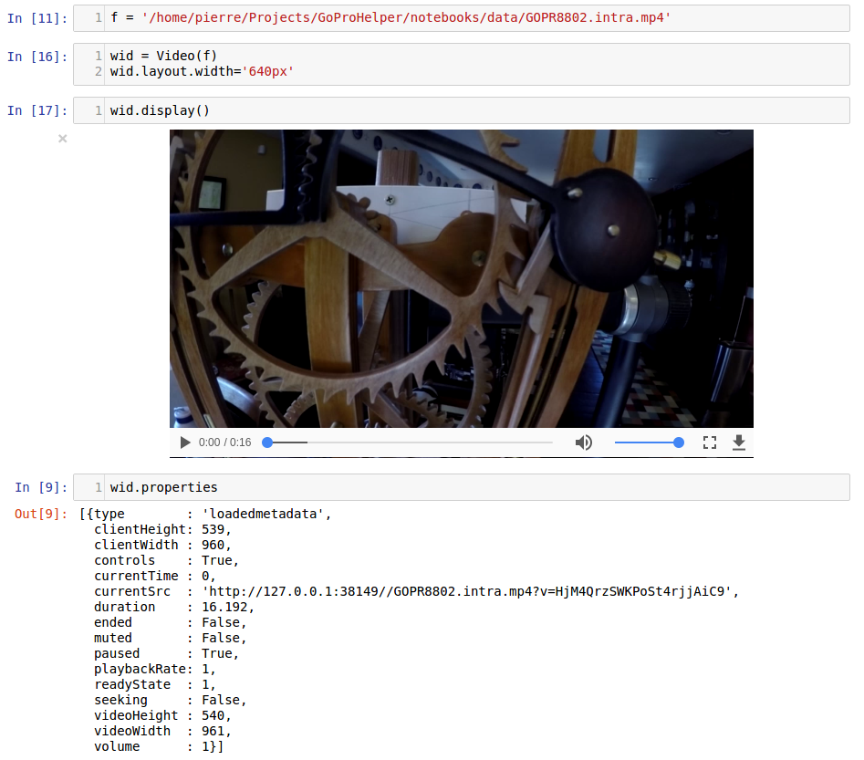

# Jupyter Video Widget

The goal of this project is to develop a custom Jupyter [widget](https://github.com/ipython/ipywidgets) making it easy to play videos (local and remote) via HTML5 video player embededed in a Jupyter Notebook. This widget project was initialized using the very handy Cookiecutter [template](https://github.com/jupyter-widgets/widget-cookiecutter).


# Example




# Install

## Prerequisites

If not already enabled, you'll need to enable the ipywidgets notebook extension that installs with Jupyter.  You can use the command `jupyter nbextension list` to see which (if any) notebook extensions are currently enabled.  Enable it with following:

```bash
jupyter nbextension enable --py --sys-prefix widgetsnbextension
```


## Standard Installation

Use pip to install:

```bash
pip install Jupyter-Video-Widget

jupyter nbextension enable --py --sys-prefix jpy_video
```


## Developer Installation

```bash
git clone git@github.com:Who8MyLunch/Jupyter_Video_Widget.git

cd Jupyter_Video_Widget

pip install -e .
jupyter nbextension install --py --symlink --sys-prefix jpy_video
jupyter nbextension enable  --py           --sys-prefix jpy_video
```


# Making Changes to JavaScript Code

Jupyter widget development uses [npm]([npm](https://docs.npmjs.com/getting-started/what-is-npm) (Node Package Manager) for handling all the scary JavaScript details. The source code for this project lives in the folder `js` and the npm package is defined by the file `js/package.json`.  The actual JavaScript source code for the video widget is contained entirely in the file `js/src/jupyter-video.js`.  This is the only JavaScript file you should need edit when working on front-end parts of this project.

After making changes to this JavaScript code it must be prepared and packaged into the `static` folder on the Python side of the project.  Do this by typing the following command from within the `js` folder:

```bash
npm install
```

See the links below for more helpful information:
- https://docs.npmjs.com/cli/install
- http://stackoverflow.com/questions/19578796/what-is-the-save-option-for-npm-install


# File Layout

Note: I found this write-up at npmjs.com very helpful in understanding the recommended folder layout: https://docs.npmjs.com/files/folders.

    - Jupyter_Video_Widget/
        - jpy_video/                All Python code lives here
            - static/               Prepared and packaged JS code ends up here
            - version.py
            - video.py              Widget Python code
            - server.py             Includes http file server with support for byte range requests
            - compound.py
            - monotext_widget.py
        - js/                       All original JavaScript code lives here
            - dist/
            - node_modules/
            - src/
                - jupyter-video.js  Widget javaScript code
                - embed.js          Only edit to update exported module name (e.g. video.js)
                - index.js          Only edit to update exported module name (e.g. video.js)
                - extension.js
            - README.md
            - package.json          Double check author name, email address, github org., etc.
            - webpack.config.js     Contains path to static JS folder on the Python side
        - setup.py
        - setup.cfg
        - MANIFEST.in               Contains relative path to static folder under jpy_video
        - requirements.txt


## Reference Information

- Jupyter widgets documentation:
    - [Jupyter widgets github](https://github.com/ipython/ipywidgets)
    - [Building a custom widget](https://ipywidgets.readthedocs.io/en/latest/examples/Widget%20Custom.html)
    - [Low-level widget tutorial](https://ipywidgets.readthedocs.io/en/latest/examples/Widget%20Low%20Level.html)

- Helpful HTML5 articles:
    - [Good stuff about implementing custom video HTML5 player](https://developer.mozilla.org/en-US/Apps/Fundamentals/Audio_and_video_delivery/cross_browser_video_player)
    - [Video player styling](https://developer.mozilla.org/en-US/Apps/Fundamentals/Audio_and_video_delivery/Video_player_styling_basics)
    - [Media buffering and seeking, nice example displaying time ranges where video is loaded](https://developer.mozilla.org/en-US/Apps/Fundamentals/Audio_and_video_delivery/buffering_seeking_time_ranges)
    - [HTML5 media events](https://www.w3.org/2010/05/video/mediaevents.html)

- More information about HTML5 and video/audio media:
    - https://www.html5rocks.com/en/tutorials/video/basics/
    - https://developer.mozilla.org/en-US/docs/Web/API/HTMLVideoElement
    - https://developer.mozilla.org/en-US/docs/Web/API/HTMLMediaElement
    - https://developer.mozilla.org/en-US/docs/Learn/HTML/Multimedia_and_embedding/Video_and_audio_content
    - https://developer.mozilla.org/en-US/Apps/Fundamentals/Audio_and_video_delivery
    - https://developer.mozilla.org/en-US/Apps/Fundamentals/Audio_and_video_manipulation
